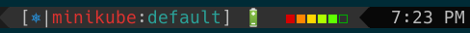

kube-tmux: Kubernetes context and namespace status for tmux
===========================================================

A script that lets you add the current Kubernetes context and namespace configured
on `kubectl` to your tmux status line.

Inspired by [kube-ps1](https://github.com/jonmosco/kube-ps1), this is a port
to tmux that includes all the features that make kube-ps1 efficient and brings
it to the tmux status line.




## Installing

## Requirements

## Plugin Structure

The default plugin layout is:

```
[<symbol>|<cluster>:<namespace>]
```

If the current-context is not set, kube-ps1 will return the following:

```
[<symbol>|N/A:N/A]
```

## Customization

## Contributors
