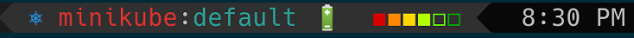

# kube-tmux: Kubernetes context and namespace status for tmux

A script that lets you add the current Kubernetes context and namespace configured
on `kubectl` to your tmux status line.

Inspired by [kube-ps1](https://github.com/jonmosco/kube-ps1), this is a port
to tmux that includes all the features that make kube-ps1 efficient and brings
it to the tmux status line.



## Installing

### Manual

Clone this repository to your `$HOME/.tmux` directory, and add the following line to your `~/.tmux.conf`:

```sh
set -g status-right "#(/bin/bash $HOME/.tmux/kube-tmux/kube.tmux 250 red cyan)"
```

250 is the color selection for the default foreground, red for the context,
and cyan for the namespace.

### TPM (Recommended)

```sh
set -g @plugin 'tmux-plugins/tpm' # mandatory
set -g @plugin 'jonmosco/kube-tmux'
```

## Requirements

* tmux
* kubectl and/or oc

## Plugin Structure

The default plugin layout is:

```sh
<symbol> <cluster>:<namespace>
```

If the current-context is not set, kube-tmux will return the following:

```sh
<symbol> N/A:N/A
```

## Customization

Colors for the default text, context, and namespace can be changed via positional arguments:

```sh
#(/bin/bash $HOME/.tmux/kube-tmux/kube.tmux text context namespace)
```

### Configuration Variables

The following environment variables can be used to customize the plugin:

| Variable | Default | Meaning |
| :------- | :-----: | ------- |
| `KUBE_TMUX_BINARY` | `kubectl` | Binary to use for fetching context and namespace |
| `KUBE_TMUX_SYMBOL_ENABLE` | `true` | Show the Kubernetes symbol |
| `KUBE_TMUX_SYMBOL_USE_IMG` | `false` | Use the wheel of dharma symbol instead of the helm |
| `KUBE_TMUX_SYMBOL_COLOR` | `blue` | Color of the Kubernetes symbol |
| `KUBE_TMUX_CONTEXT_ENABLE` | `true` | Show the current context |
| `KUBE_TMUX_NAMESPACE_ENABLE` | `true` | Show the current namespace |
| `KUBE_TMUX_DIVIDER` | `:` | Separator between context and namespace |
| `KUBE_TMUX_CTX_COLOR` | `red` | Default color of the context |
| `KUBE_TMUX_NS_COLOR` | `cyan` | Default color of the namespace |

### Custom Functions

## Customize display of cluster name and namespace

You can change how the cluster name and namespace are displayed using the
`KUBE_TMUX_CONTEXT_FUNCTION` and `KUBE_TMUX_NAMESPACE_FUNCTION` variables
respectively.

For the following examples let's assume the following:

cluster name: `sandbox.k8s.example.com`  
namespace: `alpha`

If you're using domain style cluster names, your prompt will get quite long
very quickly. Let's say you only want to display the first portion of the
cluster name (`sandbox`), you could do that by adding the following:

```sh
function get_cluster_short() {
    echo "$1" | cut -d . -f1
}

export KUBE_TMUX_CONTEXT_FUNCTION=get_cluster_short
```

The same pattern can be followed to customize the display of the namespace.
Let's say you would prefer the namespace to be displayed in all uppercase
(`ALPHA`), here's one way you could do that:

```sh
function get_namespace_upper() {
    echo "$1" | tr '[:lower:]' '[:upper:]'
}

export KUBE_TMUX_NAMESPACE_FUNCTION=get_namespace_upper
```

**Important:**  
These functions and environment variables must be defined and exported *before* `kube-tmux` is loaded in your tmux configuration. If you are using TPM, ensure you set these in your shell profile (e.g., `.bashrc`, `.zshrc`) or in a sourced script before launching tmux. If you are loading `kube-tmux` manually in your `~/.tmux.conf`, set and export these variables/functions above the `set -g status-right` line.

Example for manual setup in `~/.tmux.conf`:

```sh
# In your shell profile (before starting tmux)
function get_cluster_short() {
    echo "$1" | cut -d . -f1
}
export KUBE_TMUX_CONTEXT_FUNCTION=get_cluster_short

# In your ~/.tmux.conf
set -g status-right "#(/bin/bash $HOME/.tmux/kube-tmux/kube.tmux 250 red cyan)"
```

| Variable | Default | Meaning |
| :------- | :-----: | ------- |
| `KUBE_TMUX_CONTEXT_FUNCTION` | No default, must be user supplied | Function to customize how context is displayed |
| `KUBE_TMUX_NAMESPACE_FUNCTION` | No default, must be user supplied | Function to customize how namespace is displayed |
